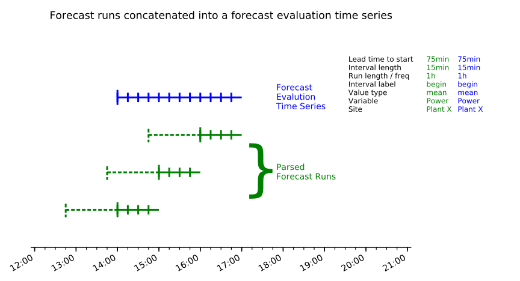
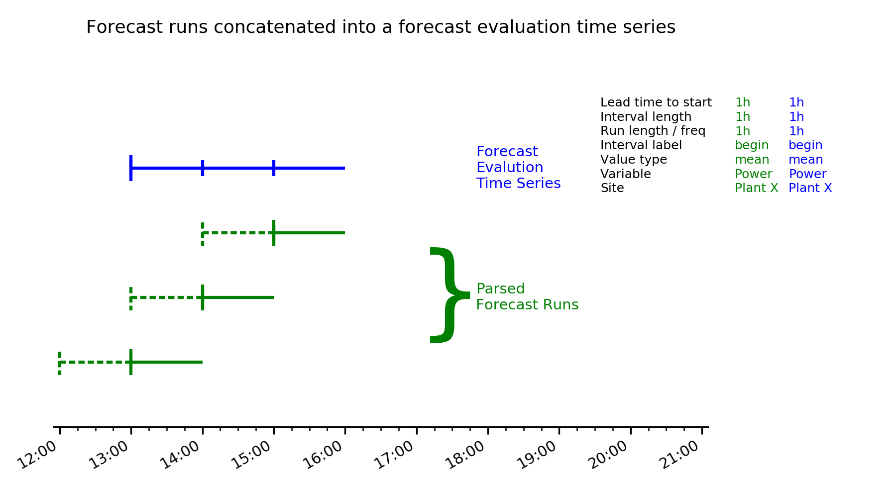
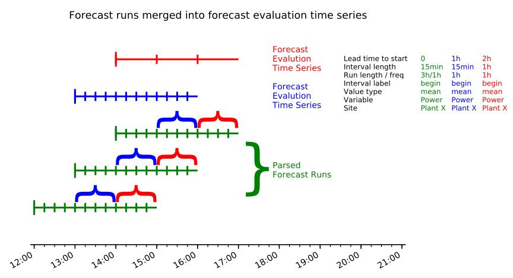

fxtimeline
==========

`python timeline.py` will create the following images in both png (first) and
svg (second) format.

timeline_concat
---------------

The figure below depicts the concatenation of three forecast runs (green) into
a single evaluation forecast (blue). The parameters are:

1.	Lead time to start of forecast: 1 hour
2.	Interval duration: 15 minutes
3.	Intervals per submission: 4
4.	Forecast issue frequency: 1 hour
5.	Value type: Any
6.  Interval label: Left

png

svg

timeline_concat_1h
------------------

The figure below depicts the concatenation of three forecast runs (green) into
a single evaluation forecast (blue). The parameters are:

1.	Lead time to start of forecast: 1 hour
2.	Interval duration: 1 minutes
3.	Intervals per submission: 1
4.	Forecast issue frequency: 1 hour
5.	Value type: Any
6.  Interval label: Left

png

svg

timeline_merged
---------------

The figure below depicts three forecast runs (green) merged into
two different evaluation forecasts (blue, red).

The green forecast run parameters are:

1.	Lead time to start of forecast: 0
2.	Interval duration: 15 minutes
3.	Intervals per submission: 12
4.	Forecast issue frequency: 1 hour
5.	Value type: Any
6.  Interval label: Left

The blue evaluation forecast parameters are:

1.	Lead time to start of forecast: 1 hour
2.	Interval duration: 15 minutes
3.	Intervals per submission: 4
4.	Forecast issue frequency: 1 hour
5.	Value type: Any
6.  Interval label: Left

The red evaluation forecast parameters are:

1.	Lead time to start of forecast: 2 hour
2.	Interval duration: 1 minutes
3.	Intervals per submission: 1
4.	Forecast issue frequency: 1 hour
5.	Value type: Any
6.  Interval label: Left

png

svg

Requirements
------------

probably matplotlib 3.0
